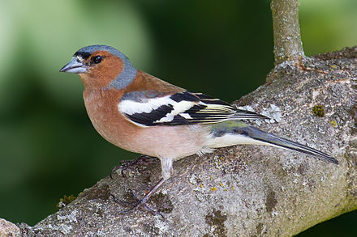

```{r packages}
library(kableExtra)
library(gt)
library(flextable)
library(knitr)
```

# Introduction
Chaffinches [@Browne2004-gz]
```{r, out.width="30%", fig.cap="*Fig.1* Photograph of a male chaffinch. Photo by © Andreas Trepte, commons.wikimedia.org/wiki/File:pic1.jpg"}

```

# Discussion
devtools::install_github("ropensci/RefManageR")
devtools::install_github("crsh/citr")
citation("package")

t.test(data= chaff, mass ~ sex, paired = TRUE)


